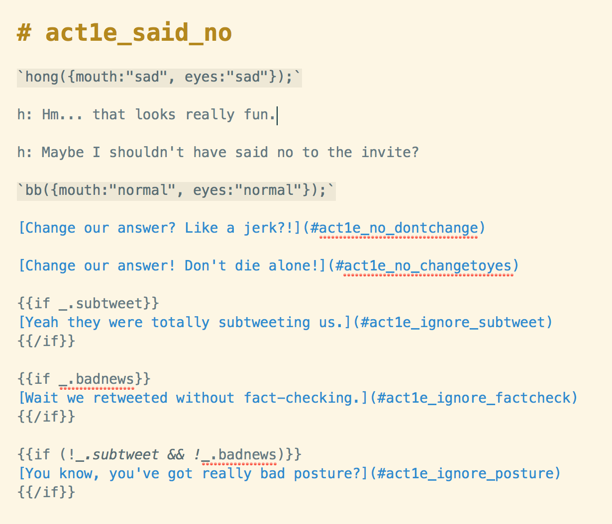
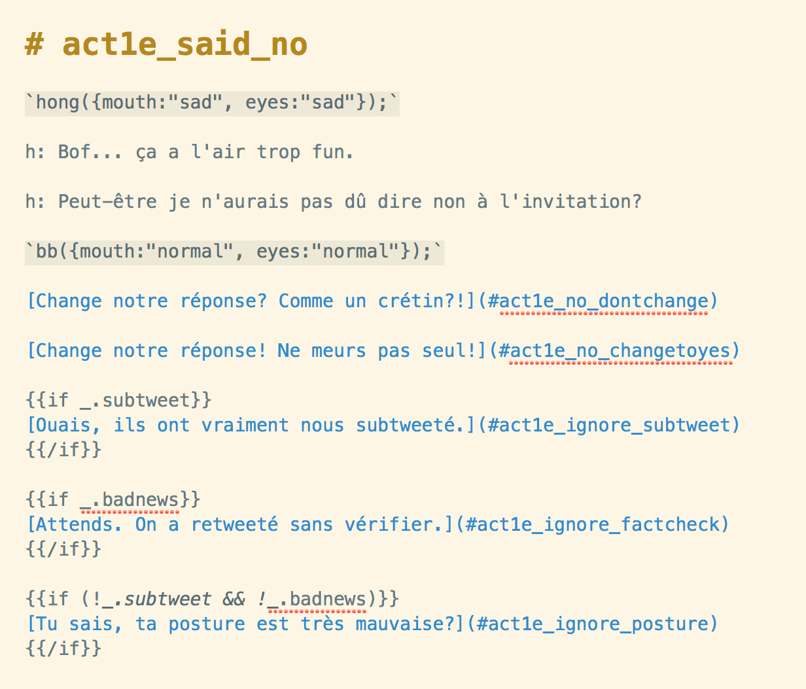
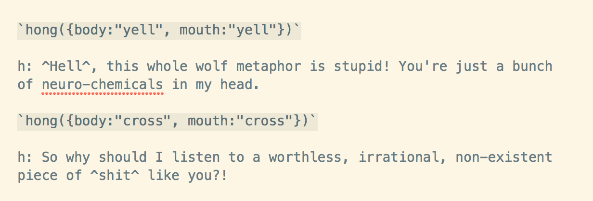
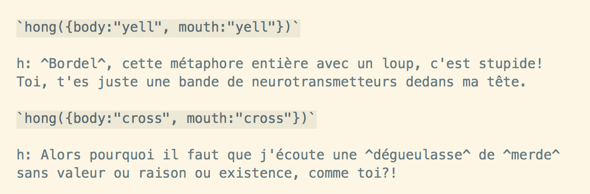
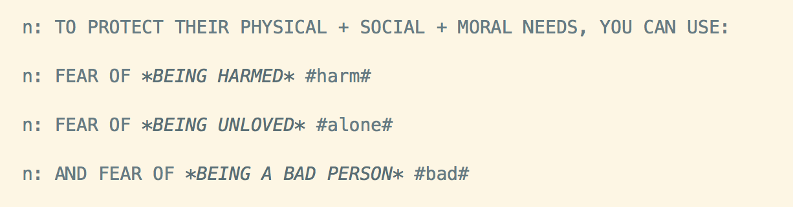
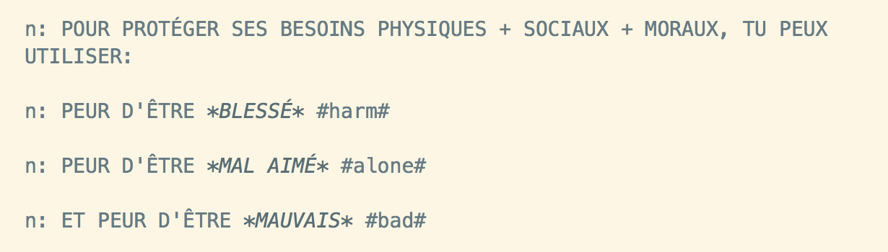
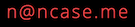

# [Сыграй в интерактивную историю!](https://ncase.me/anxiety/)

## Public Domain

Nicky Case и Monplaisir таким образом посвящают всю их работу для общественного достояния, под [Creative Commons Zero](https://creativecommons.org/choose/zero/).
Это значит: вы можете переиспользовать и изменять *любой* оригинальный код / музыку / изображения для *любых* нужд, даже в коммерческих целях!

**Q:** Должен ли я указывать авторство?   
**A:** *Легально* вы не обязаны, но это очень высоко ценится! <3

**Q:** С точки зрения легальности, могу ли я утверждать, что *я* это сделал?    
**A:** Да, точно так же, как вам легально можно утверждать, что вы написали "Франкенштейна", или утверждать, что у вас 13 сосков.

**Q:** Могу ли я запостить эту игру на других сайтах?   
**A:** Возможно. Хотя это полностью законно с точки зрения авторского права, многие сайты имеют свою собственную политику против размещения чужих работ в открытом доступе/с открытым исходным кодом *без* существенных изменений. (Но если это ваш собственный сайт, то ради всего святого, можете разместить эту игру!) 

**Q:** Могу ли я продавать порт этой игры?  
**A:** Да! Но чтобы избежать путаницы, я рекомендую маркировать вашу игру как "Фанатский порт" и *ссылаться на это заявление, говоря, что я явно разрешаю коммерческие ремиксы*. (Пример: [Steam-порт одной из моих других игр!](https://store.steampowered.com/app/1103210/We_Become_What_We_Behold_FanMade_Port/)) Это делается для того, чтобы избежать обвинений в краже от людей, которые не знали, что я всегда открываю исходный код + публикую свои проекты в открытом доступе.

**Q:** Могу ли я превратить эту игру в симулятор свиданий между человеком и волком? 
**A:** ам...


## Полные титры

Арт / Код / Написан [Nicky Case](https://ncase.me/)

Музыка от [Monplaisir](https://loyaltyfreakmusic.com)

Дополнительный код от [Spacie](https://spacie.me)

**Звуковые эффекты из FreeSound.org (Creative Commons)**

* [Intro Scream](https://freesound.org/people/analogchill/sounds/35716/) by MaderaDelEste Films
* [Dramatic Hit](https://freesound.org/people/qubodup/sounds/222517/) by qubodup
* [Nature Ambience](https://freesound.org/people/michorvath/sounds/427601/) by michorvath
* [Grass Footstep 1](https://freesound.org/people/morganpurkis/sounds/384651/) by morganpurkis
* [Grass Footstep 2](https://freesound.org/people/morganpurkis/sounds/384643/) by morganpurkis
* [Eating a Sandwich](https://freesound.org/people/dleverett/sounds/441906/) by dleverett
* [Search a Bag](https://freesound.org/people/Tristan_Lohengrin/sounds/233441/) by Tristan\_Lohengrin
* [Whoosh](https://freesound.org/people/crackles04/sounds/369698/) by crackles04
* [Empty Room Ambience](https://freesound.org/people/kyles/sounds/451616/) by kyles
* [Ball Bounce](https://freesound.org/people/13GPanska_Lakota_Jan/sounds/378355/) by 13GPanska\_Lakota\_Jan
* [Faucet](https://freesound.org/people/calivintage/sounds/95709/) by calivintage
* [Pop](https://freesound.org/people/onikage22/sounds/240566/) by onikage22
* [Angry Scream](https://freesound.org/people/cdrk/sounds/21324/) by cdrk
* [Dirty Explosion](https://freesound.org/people/Link-Boy/sounds/156615/) by Link-Boy
* [Clothes Rustle](https://freesound.org/people/leonelmail/sounds/427866/) by leonelmail
* [Typewriter](https://freesound.org/people/tams_kp/sounds/43559/) by tams\_kp
* [Yelp](https://freesound.org/people/J%C3%BAliaLN/sounds/382990/) by JúliaLN
* [Tension Building](https://freesound.org/people/benjaminharveydesign/sounds/316649/) by benjaminharveydesign
* [Short Fart](https://freesound.org/people/DSISStudios/sounds/241000/) by DSISStudios
* [Party Crowd](https://freesound.org/people/kyles/sounds/453925/) by kyles
* [Party Music](https://freesound.org/people/djfroyd/sounds/324779/) by djfroyd
* [Party Crowd 2](https://freesound.org/people/Adam_N/sounds/346687/) by Adam\_N
* [Party Music 2](https://freesound.org/people/djfroyd/sounds/325155/) by djfroyd
* [Vinyl Scratch](https://freesound.org/people/filmsndfx/sounds/369673/) by filmsndfx
* [Jacob's Ladder](https://freesound.org/people/bethanyjodenton/sounds/466477/) by bethanyjodenton
* [Yap Yap Yap](https://freesound.org/people/Robinhood76/sounds/327813/) by Robinhood76
* [Door Close](https://freesound.org/people/InspectorJ/sounds/411791/) by InspectorJ
* [Door Lock](https://freesound.org/people/Fabrizio84/sounds/458013/) by Fabrizio84
* [Judge Gravel](https://freesound.org/people/qubodup/sounds/215164/) by qubodup
* [Bottles Clinking](https://freesound.org/people/HDM2013/sounds/179438/) by HDM2013
* [Drinking](https://freesound.org/people/georgisound/sounds/369293/) by georgisound
* [Concrete Footsteps](https://freesound.org/people/harrietniamh/sounds/219673/) by harrietniamh
* [Slide Whistle](https://freesound.org/people/sheepfilms/sounds/432546/) by sheepfilms
* [Ambulance Siren](https://freesound.org/people/sofialomba/sounds/469413/) by sofialomba
* [Distant Ambulance Sirens](https://freesound.org/people/ivolipa/sounds/337099/) by ivolipa
* [ICU Room](https://freesound.org/people/chaffron/sounds/132074/) by chaffron
* [EMT Radio](https://freesound.org/people/relwin/sounds/397087/) by relwin
* [Inside A Driving Truck](https://freesound.org/people/RutgerMuller/sounds/50910/) by RutgerMuller
* [Karate HI-YA](https://freesound.org/people/AmeAngelofSin/sounds/326888/) by AmeAngelofSin
* [Canned Sitcom Laughter](https://freesound.org/people/Kinoton/sounds/371562/) by Kinoton
* [Clap 1](https://freesound.org/people/InspectorJ/sounds/404542/) by InspectorJ
* [Clap 2](https://freesound.org/people/InspectorJ/sounds/404539/) by InspectorJ
* [Clap 3](https://freesound.org/people/InspectorJ/sounds/404541/) by InspectorJ
* [Duck Quack](https://freesound.org/people/qubodup/sounds/442820/) by qubodup
* [Glass Breaking](https://freesound.org/people/Samgd14/sounds/355340/) by Samgd14
* [Bottle on Concrete](https://freesound.org/people/13GPanska_Gorbusinova_Anna/sounds/377986/) by 13GPanska\_Gorbusinova\_Anna
* [Cartoon Running](https://freesound.org/people/Mountain852/sounds/365830/) by Mountain852

**Звуковые эффекты из Kenney.nl (All Creative Commons Zero)**

* [Digital Audio Pack](https://kenney.nl/assets/digital-audio)
* [RPG Audio Pack](https://kenney.nl/assets/rpg-audio)
* [UI Audio Pack](https://kenney.nl/assets/ui-audio)

**Copyrighted Sounds That I Really Hope Count As Fair Use:**

* The Pokémon theme song is © The Pokémon Company. I used a ~22s  instrumental clip for a parody song about Tinder.
* The "Hadouken!" sound is © Capcom. I used it as parody for the anxiety wolf's Special Attack.


**Open Source Libraries**

* [Howler.js](https://howlerjs.com/) by James Simpsson for sounds
* [MinPubSub](https://github.com/daniellmb/MinPubSub) by Daniel Lamb for pub/sub
* [RSVP.js](https://github.com/tildeio/rsvp.js/) by Tilde for promises
* [Simple Sharing Buttons](https://simplesharingbuttons.com/) by Stefan Bohacek
* [Ceaser](https://matthewlein.com/tools/ceaser) by Matthew Lein for CSS animation

**Thank you to my playtesters!**

B Cavello, EmilyKate McDonough, Glen Chiacchieri, Mikayla Hutchinson, Monica Srivastava, Rowan, Srini Kadamati

**And of course, thank you to the generous support of [my fans on Patreon.](https://www.patreon.com/ncase)** Luv y'all <3

## How To Translate

**TRANSLATIONS COMPLETE:** 
[Русский](https://notdotteam.github.io/anxiety/),
[Português do Brasil](https://lucasgcb.github.io/anxiety/),
[Deutsch](https://jonasreich.github.io/anxiety/),
[Español (Europeo)](https://jorgeygari.github.io/anxiety/),
[Español (Latino)](https://fantasmashy.github.io/anxiety-Es-La/),
[中文](https://z-lyen.github.io/anxiety/),
[中文（臺灣）](https://audreyt.github.io/anxiety/),

Okay. I super, super seriously apologize in advance.

Translating this thing will *suck.*

Thus, I highly recommend collaborating online on a translation! There's about 9,000 words to translate, the rules of what to translate or not are a bit weird, and you'll need to edit some images. But if you're still up for it...

### Step 0:

[Check the existing issues](https://github.com/ncase/anxiety/issues?utf8=✓&q=is%3Aissue+is%3Aopen+translation) to see if everyone else has already started your desired translation. If someone already started, go help them! :)

### Step 1:

[Make a fork](https://help.github.com/en/articles/fork-a-repo) on Github!

### Step 2:

*POST A GITHUB ISSUE WITH A LINK TO YOUR FORK.* This will let folks a) know a translation is in process, and b) let *you* find collaborators for the translation process!

### Step 3:

Translate all the Markdown files in `/scenes`. (about 9000 words) Personally I use [MacDown](https://macdown.uranusjr.com/) (Mac only), but there's [a whole bunch of other free open-source Markdown editors](https://opensource.com/article/18/11/markdown-editors).

**THERE ARE RULES OF WHAT TO TRANSLATE OR NOT.** It's probably best to show it with examples. Excuse my terrible French...

Original English:



Translated to "Nicky's Attempt At French":



As you can see, you *don't* translate everything.

**Just translate:**

* Anything after a letter + colon. This changes a dialogue *spoken*. "h:" is hong the human, "b:" is beebee the wolf, etc.
* Anything in the square brackets of `[words words words](#section_name)`. This changes the dialogue *choices.*

**Do NOT translate:**

* Anything within ``` `code({with:"backticks",like:"this"});` ```. This is the code that runs between dialogue lines.
* Anything within ``` {{ these brackets either }} ```. These allow for changes in dialogue based on previous choices (see example above).
* Any line that starts with a `#`. That's a section name.
* The part in the *round* brackets in `[words words words](#section_name)`. That's the name of the section you'll go to if you select that dialogue choice.

**Suggestions:**

* Try *NOT* to make any translated line go too much longer than the original. Otherwise dialogue may go off-screen. Paraphrase or cut words if you have to.
* Use asterisks for `*emphasis*`. This will italicize the words in the dialogue! (This is standard Markdown syntax)
* Try to keep pronouns gender-neutral (e.g. English's singular "they") for referring to characters or the player. If your target language doesn't allow that, then flip a coin for each character's gender, or something.

Oh but of *course* that's not all the rules! Two more rules, for swear words:

Original English:



Excusez mon français:



**Rules for translating swears:**

* Put all swear words in `^fucking^ carat symbols`. This is so they can be replaced with @#&!✩@ in the Cuss-Free Mode.
* Beebee the wolf (almost) never swears. They swear a couple times in the perverted Pokémon parody song but that's it. Otherwise, they say "Heck" and "Dang".

**One more dumb rule: Don't translate any words within #pounds#.**

Like so. English:



French:



This was a bad system I have made.

P.S: To jump around different scenes, type `Game.debug()` into the Javascript console.
If you hover over a gray box on the left, you'll see a sidebar that lets you jump to any scene.
(Note: this make break stuff!) You can also uncomment the lines in `main.js` to test out the game
starting from different chapters.

### Step 4:

Translate `index.html`. (about 70 words) There's further instructions in that file itself. (Feel free to add yourself + your collaborators as translators in the top-left corner!)

This translates some UI, and helps search engines + social networks understand the page is in your target language.

### Step 5:

Translate the images. This step sucks. You can use an image-editing program like MS Paint or [GIMP](https://www.gimp.org).

If you don't feel like re-drawing text, [you can find open-source "handwritten" fonts on Google Fonts](https://fonts.google.com/?category=Handwriting). (I used [Sniglet](https://www.theleagueofmoveabletype.com/sniglet) for some text)

Images to translate: (about 70 words)

* `sharing/thumb.png` (so when folks share your game on social media, the thumbnail's in your language! in the same folder, I put a `thumb_no_words.png` image to help you make a new thumbnail.)
* `sprites/about/cc0.png`
* `sprites/about/replay.png`
* `sprites/act4/callback.png`
* `sprites/credits/end_message.png`
* `sprites/credits/screens.png` (feel free to add yourself in closing credits as a translator)
* `sprites/credits/starring.png`
* `sprites/credits/thanks.png`
* `sprites/intermission/youwin.png`
* `sprites/intro/intro_logo.png` (feel free to add yourself in opening credits as a translator)
* `sprites/ui/fear_captions.png`
* `sprites/ui/preloader.png`

### Step 6:

Your translated game is DONE! Now you just need to put it online. You can follow [Github Pages's instructions](https://pages.github.com) for free hosting. (it's the same way I'm hosting my game)

### (OPTIONAL STEP):

This game also has a link to a list of Mental Health Tips & Resources, [on a different webpage](https://ncase.me/mental-health). It's not part of the "main" game, but it may still be valuable to make accessible in more languages.

[The repo & instructions for translating that are here!](https://github.com/ncase/mental-health)

### Step 7: TELL ME YOU ARE *DONE* 🎉🎉🎉

Email me at  so I know you're done!

Do ***NOT*** send a Pull Request to *this* repo, because that will change the *original* game. I will, however, edit the original game to have a link to your translation!

I'm usually busy and/or bad at email, so it'll take me a while to get around to it, but if I don't respond for a week, ping me again!

Thank you you're the beeeeeest 💖🐺💖


